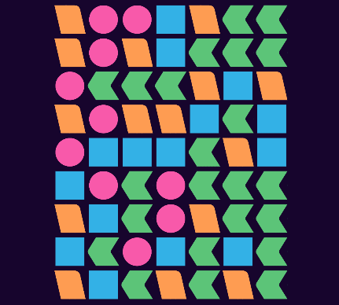

# NRK-former-game

Code that attempts to solve NRK's game "Former" (similar to SameGame).




## The Board class

A Board is an immutable class that represents a game.
Colors are represented as integers 1, 2, 3, ... on a grid.

```pycon
>>> grid = [[1, 2],
...         [2, 1]]
>>> board = Board(grid)
>>> board
Board([[1, 2], [2, 1]])
>>> print(board)
12
21
```

Clicking on a board returns a new instance, that can be printed:

```pycon
>>> board = board.click(0, 1)
>>> print(board)
10
21
```

All valid clicks (non-zero cells) are given by the `yield_clicks` method:

```pycon
>>> list(board.yield_clicks())
[(0, 0), (1, 0), (1, 1)]
```

Statistics can be retrieved using these methods:

```pycon
>>> len(board)  # The board has size 2 x 2 = 4
4
>>> board.remaining()  # There are three cells remaining (non-zero)
3
>>> board.cleared()  # One cell has been cleared
1
>>> board.unique_remaining()  # There are two unique remaining numbers
2
```

The Board instances are immutable - a new instance is always returned.

```pycon
>>> original_board = Board(grid)
>>> new_board = original_board.click(0, 0)
>>> print(new_board)
02
21
>>> print(original_board)
12
21
>>> new_board == original_board
False
```

A canonical representation re-labels the numbers in increasing order and
flips the board if needed.

```pycon
>>> grid = [[3, 3, 3],
...         [2, 2, 3],
...         [2, 1, 2]]
>>> board = Board(grid).canonicalize()
>>> print(board)
111
122
232
>>> print(board.click(1, 1).canonicalize())  # Here the board is flipped
001
011
123
```

A simpler approach is to simply relabel the board:

```pycon
>>> grid = [[3, 3, 3],
...         [2, 2, 3],
...         [2, 1, 2]]
>>> board = Board(grid).relabel()
>>> print(board)
111
221
232
```

Boards are considered equal iff all cells are equal, not if their canonical
forms are equal. Canonicalization is an indempotent function, so applying it
twice gives the same result as applying it twice.

```pycon
>>> Board(grid) == Board(grid).canonicalize()
False
>>> Board(grid).canonicalize() == Board(grid).canonicalize().canonicalize()
True
```

Finally, all children (results of all valid clicks) can be retrieved:

```pycon
>>> for move, child in board.children():
...     assert board.click(*move) == child
...     print(child)
...     print()
000
220
232

001
011
132

101
211
222

110
221
231

```